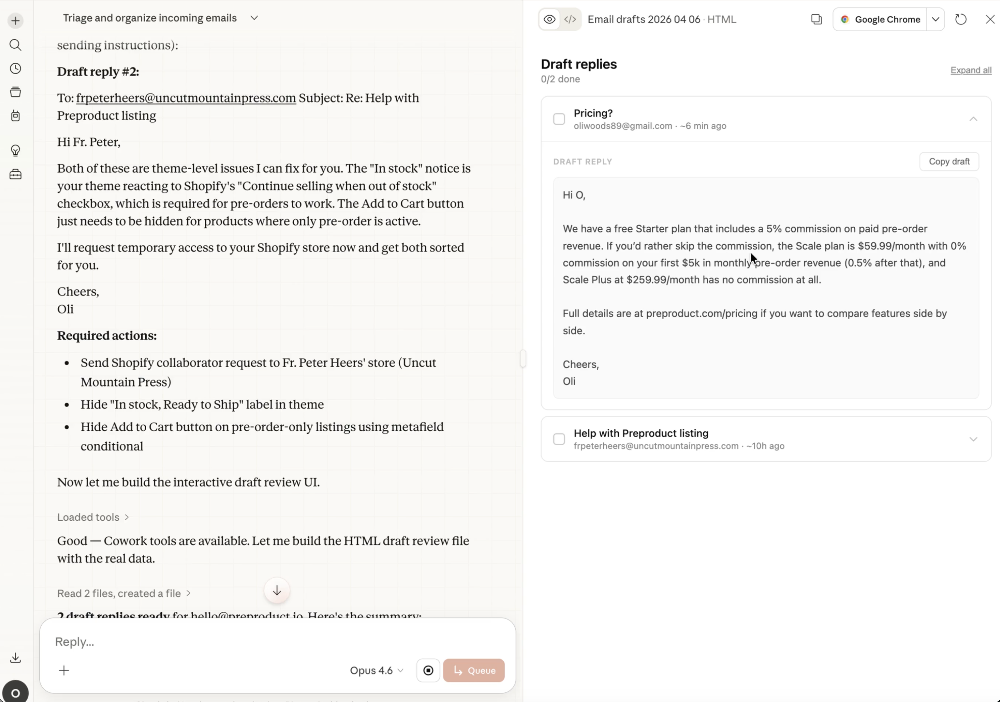
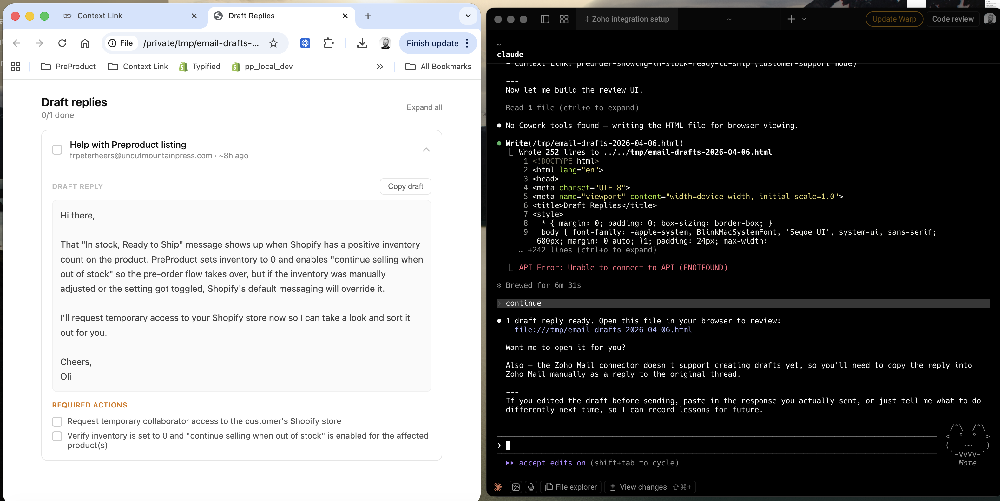
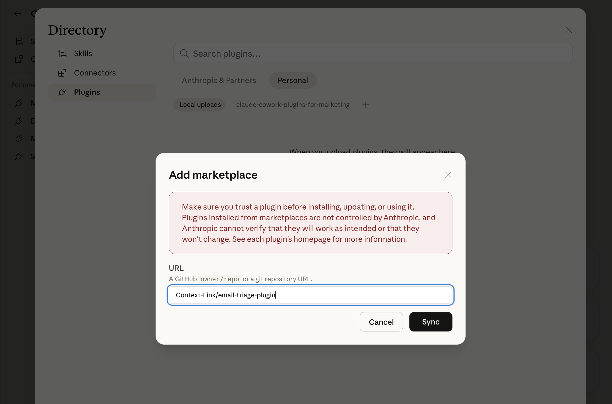
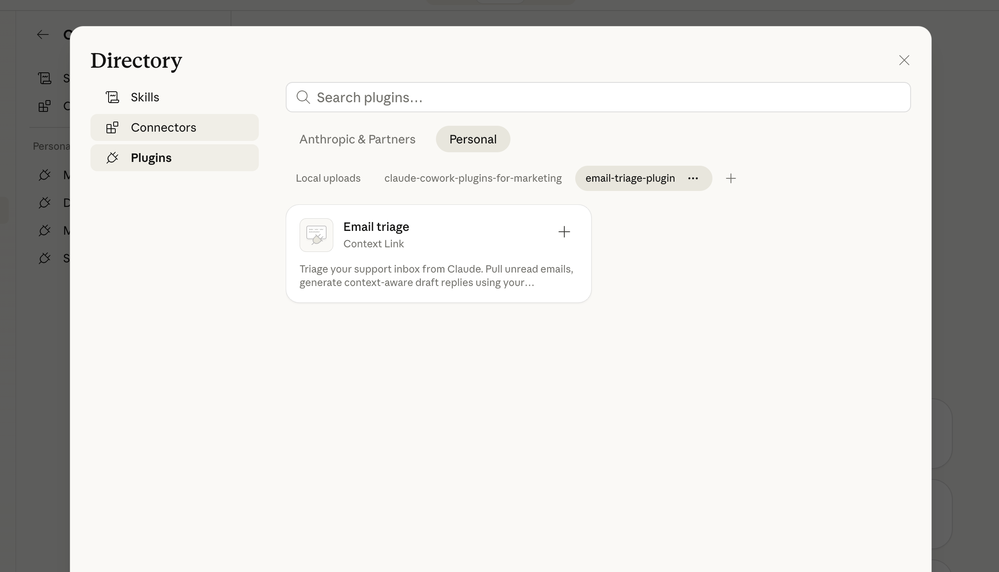
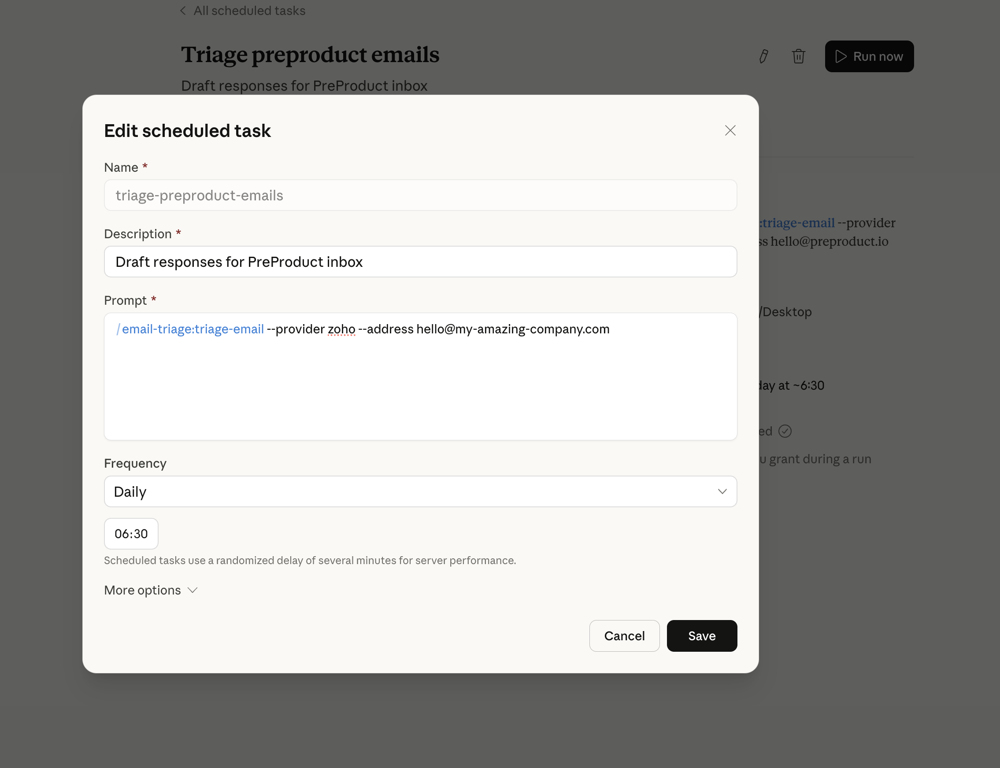
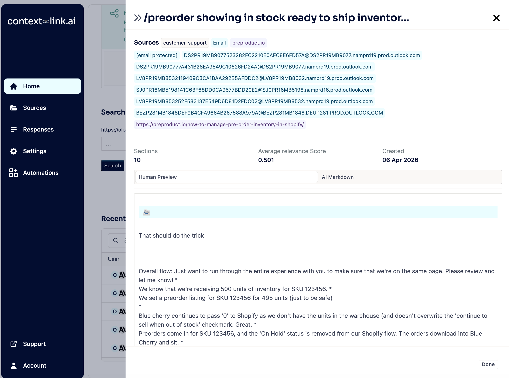

# Email Triage Plugin for Claude



<details>
<summary>Also works with Claude Code</summary>



</details>

**Triage your support inbox from Claude. Pull unread emails, generate context-aware draft replies using your knowledge base, and review them in an interactive UI, ready for a human to copy, edit, and send.**

The plugin learns from your corrections over time. After each triage run, you can paste the replies you actually sent or give direct feedback. Lessons are stored in your [Context Link](https://www.context-link.ai) knowledge base and applied to future drafts automatically. Don't use Context Link? No problem, the plugin can try to fall back to Claude's built-in memory to save and recall lessons between sessions.

Works in both **Claude Desktop (Cowork)** and **Claude Code (CLI)**. Everything runs in the cloud (email fetching via Gmail or Zoho MCP, context retrieval via Context Link) so can be used outside of your local computer.

## Installation

### Claude Desktop (Cowork)

1. Open the Claude Desktop app and switch to the **Cowork** tab
2. Click **Customize** in the left sidebar
3. Under **Personal plugins**, click **+** -> **Browse plugins**
4. Select the **Personal** tab -> **+** -> **Add marketplace**
5. Enter: `Context-Link/email-triage-plugin` -> Then click **+** once the **Email triage** skill has loaded

<sub>
    <i>
        *Once you've been through one successful `/triage-email` and your sources are setup, you can add a recurring scheduled task (screenshot below).
        [From Anthropic:](https://support.claude.com/en/articles/13854387-schedule-recurring-tasks-in-cowork) Scheduled tasks only run while your computer is awake and the Claude Desktop app is open. If your computer is asleep or the app is closed when a task is scheduled to run, Cowork will skip the task, then run it automatically once your computer wakes up
    </i>
</sub>


<details>
<summary>Screenshots</summary>





</details>

### Claude Code (CLI)

```bash
/plugin marketplace add Context-Link/email-triage-plugin  
/plugin install email-triage@email-triage
/reload-plugins 
```

<details>
<summary>Screenshot</summary>


</details>

Plugin source: [github.com/Context-Link/email-triage-plugin](https://github.com/Context-Link/email-triage-plugin)

## How it works

### Triage flow

1. **Connect** — Choose Gmail or Zoho Mail, pick which email address to triage
2. **Fetch** — Pull all unread emails from the last 24 hours (spam and automated notifications are skipped)
3. **Draft** — Each reply is generated using your Context Link knowledge base (if connected) and any lessons from previous corrections
4. **Review** — Drafts appear in an interactive UI with collapsible cards, copy buttons, and action checklists
5. **Learn** — After you send the replies, paste back what you actually sent or tell Claude what to do differently. Lessons are saved to Context Link (or alternatively attempt to write to Claude's built-in memory) and used in future runs.

In **Cowork**, the draft UI renders inline as an artifact. In **Claude Code**, it opens in your default browser.

### Standalone reply

Paste any customer email and run `/draft-reply`. The plugin looks up relevant context, applies learned lessons, scrubs AI tells from the output, and drafts a reply you can send or lightly edit.

## Commands

| Command | Description |
|---|---|
| `/triage-emails` | Pull unread emails, generate draft replies, and display them in the interactive UI |
| `/draft-reply` | Paste a single customer email and get a context-aware draft reply |

## Skills

| Skill | What it does |
|-------|-------------|
| `triage-email` | Orchestrates the full triage workflow: fetch, draft, display, learn |
| `draft-email-response` | Generates a single context-aware draft reply with required actions |
| `scrub` | Removes AI tells from draft text (filler phrases, watermarks, overly enthusiastic language) |
| `get-context` | Retrieves relevant knowledge and past email context from Context Link |
| `update-memory` | Saves learned lessons back to Context Link for future runs |

## Setup

### Email provider (required)

Connect at least one email provider:

- **Gmail** — Enable the Gmail connector in **Settings → Connectors → Gmail**
- **Zoho Mail** — Set up at [zoho.com/mcp](https://www.zoho.com/mcp/), select Zoho Mail, and follow the setup steps (required enabled tools: "getMailAccounts, listEmails, SearchEmails")

### Knowledge base (recommended)

This plugin uses [Context Link](https://context-link.ai) for two things: retrieving support context when drafting replies, and storing lessons learned from your corrections.

1. Sign in at [context-link.ai](https://context-link.ai)
2. Connect your support docs, website, and knowledge sources
3. The plugin will automatically look up relevant context when drafting and save lessons when you provide feedback

<details>
<summary>Screenshot</summary>



</details>

Without Context Link, the plugin still works. Replies are drafted from the email content alone, and the plugin will attempt to save and recall lessons using Claude's built-in memory. This is more limited than Context Link (no external knowledge retrieval, and memory persistence depends on Claude's auto memory working correctly) but requires no setup other than adding the Gmail or Zoho connector.

## Example usage

### Triage your inbox

```
> triage my zoho inbox for hello@example.com
```

Pulls unread emails, drafts replies for each, and displays them as interactive cards.

### Quick reply to a single email

```
> /draft-reply
[paste customer email]
```

Looks up context, drafts a reply, and prompts you for feedback to learn from.

### Skip the prompts

```
> /triage-emails --provider zoho --address hello@example.com
```

Passes arguments directly so there are no setup questions.

## MCP connectors

This plugin uses the following MCP servers (configured in `.mcp.json`):

- **Gmail** — Fetch and search emails via the Gmail MCP
- **Zoho Mail** — Fetch and search emails via the Zoho MCP
- **Context Link** — Retrieved via HTTP (no MCP server needed; uses the get-context skill)
